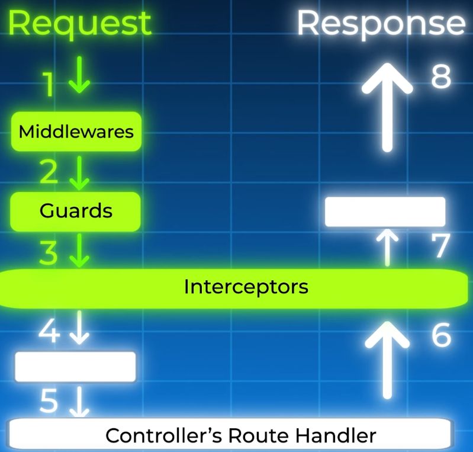

src = https://www.youtube.com/watch?v=IdsBwplQAMw

# 1. Application Types

There is a misconception that NestJS in only for building APIs.  

In fact, there are 3 types of applications you can build with Nest:

- **an HTTP server application**, using `NestFactory.create`:
```ts
import { NestFactory } from '@nestjs/core';
import { AppModule } from './app.module';

async function bootstrap() {
  const app = await NestFactory.create(AppModule);
  await app.listen(3000);
}
bootstrap();
```

- **a Microservice application**, using `NestFactory.createMicroservice`:
```ts
import { NestFactory } from '@nestjs/core';
import { AppModule } from './app.module';
import { Transport, MicroserviceOptions } from '@nestjs/microservices';

async function bootstrap() {
  const app = await NestFactory.createMicroservice<MicroserviceOptions>(
    AppModule,
    {
      transport: Transport.TCP,
    },
  )
  await app.listen();
}
bootstrap(); 
```

Microservices are very similar to HTTP servers, except that they can use different transport protocols and 
communicate through internal networks.  

- **a standalone application**, using `NestFactory.createApplicationContext`:
```ts
import { NestFactory } from '@nestjs/core';
import { AppModule } from './app.module';
import { AppService } from './app.service';

async function bootstrap() {
  const app = await NestFactory.createApplicationContext(AppModule);
  const appService = app.get(AppService);
  appService.doSomething();
}
bootstrap();
```

A standalone application is just an application that doesn't have network listeners.  
They are great for creating scheduled tasks, or CLI tools.

# 2. Modules

All Nest applications need a **root module**.  
Modules are the building blocks of a Nest application.  

At the top, you always have a root module, which can use other modules.  
And those other modules can also use other modules, and so on...  

In terms of implementation, a module is a **class** that is annotated with a `@Module()` **decorator**:
```ts
import { Module } from '@nestjs/common';

@Module({})  // decorator
export class AppModule {}
```

Decorators are very important and are everywhere in NestJS.  

# 3. Decorators

A decorator is a special kind of function that can be attached to classes, methods, properties...  
It can modify their behavior and add metadata to them.  

```ts
@classDecorator()
class MyClass {
  @MethodDecorator()
  myMethod(@ArgDecorator() myArg: string) {
    // ...
  }
}
```

Think of decorators as wearing accessories or suits that give you special abilities.  

# 4. Application Module Graph

In the context of a NestJS application, the "application module graph" refers to the internal **structure** that represents how 
all **modules** within the app are **interconnected**, including their dependencies and relationships to each other.  

Every NestJS app has at least a root module. This is the starting point where Nest begins to construct the application graph.  

To create the application module graph, we need to define relationships between Modules.  

In NestJS, relationships between modules are defined primarily through the `@Module()` decorator, which organizes modules and their interdependencies using four main properties:

- **imports**: this property lists other modules that this module depends on. When you import a module, you can use the providers that it exports
- **exports**: this specifies which providers (services, etc.) the current module makes available to other modules that import it.
- **providers**: these are the services/providers instantiated by the Nest **injector** within this module, which can be shared across the module or exported for use in other modules
- **controllers**: The controllers that belong to this module

By combining these, Nest builds an internal graph to resolve relationships and dependencies between modules and their providers.

# 5. Controllers

Once we have our Modules defined, we can add Controllers inside them.  
Controllers are classes that are annotated with the `@Controller()` decorator.  

**A controller is in charge of receiving incoming requests and returning a response.**  
Anything else is delegated to other classes.  

We can define a route path in the controller decorator, then we add methods to handle the incoming requests.  
Those methods can be annotated with a HTTP verb, and those decorators can take a subroute as parameter.  

```ts
import { Controller } from '@nestjs/common';

@Controller('my-app')  // route path
export class AppController {
  @Get('hello')  // HTTP verb with subroute
  hello() {
    return 'Hello World!';
  }
}
```

# 6. Providers

Most of the code you'll be writing in Nest is within providers.  
A provider is simply a class that can be injected into other classes as a dependency.  

Let's take a `UserService` class as an example:
```ts
@Injectable()  
export class UserService {
  getUser() {
    return { id: 1, name: 'Bob' };
  }
}

@Controller()
export class UserController {
  constructor(private userService: UserService) {}

  @Get()
  getUser() {
    return this.userService.getUser();
  }
}

@Module({
  providers: [UserService],
  controllers: [UserController],
})
export class UserModule {}
```
By annotating the `UserService` class with the `@Injectable()` decorator, we indicate that it's a provider.  
Then, we also declare it as a provider in the `UserModule` class using the `providers` property.  
And finally, we can inject it into the controller via the constructor.  

## Dependency Injection & the Singleton Pattern

The next two chapters explain in more details the 2 core concepts we need to understand when it comes to **providers**.  

In summary, NestJS uses **Dependency Injection** as the mechanism to provide the `UserService` to the `UserController`, 
and by default, the `UserService` instance it provides is a **Singleton**, meaning it's the same instance used everywhere 
else in our application.

# 7. Dependency Injection

Dependency Injection (DI) is a **core concept** in NestJS that allows a class tp receive its dependencies 
from an outside source, rather than creating them itself.  

This makes our code more modular, decoupled, and easier to test.  

## Declaring a dependency

The `UserService` class above is **decorated** with `@Injectable()`.  
This decorator **marks** the class as a *provider* than can be managed by the NestJS Inversion of Control (IoC) container.  

## Registering the provider

Inside the `UserModule`, we list `UserService` in the `providers` array.  
This tells the `UserModule` that `UserService` is available for injection within this module.

## Injecting the dependency

The `UserController` needs to use the logic from `UserService`.  
When NestJS creates an instance of `UserController`, it sees the `UserService` type in the constructor.  
It then looks for a registered provider of that type, finds the one we registered in the module, and automatically injects it.  

The key benefit is that `UserController` is no longer responsible for creating or managing `UserService`.  
It's completely decoupled, making it simple to swap `UserService` with a mock version for testing, for example.  

# 8. Singleton Pattern

The singleton pattern ensures that a class has **only one instance** and provides a **single** global **point of access** to it.  

In NestJS, providers are singletons by default.  

In our example at chapter 6, when the application starts: 
- NestJS scans the modules and sees that `UserService` is a provider in `UserModule`.  
- It then creates a single instance of `UserService` and caches it.   
- Every time any class asks for `UserService` to be injected, NestJS provides that **exact same instance**

So, if we had ten different controllers all depending on `UserService`, they would all share the one and only `UserService` object.  
This is highly efficient as it saves memory and ensures that any state held within the service is shared across the application.  

# 9. Middlewares

We can make a request go through several stages before hanlding it over to the (HTTP) method handler.  
For example, we could use Middleware to log every incoming request.  

We don't need to add middlewares everywhere since Nest comes with **built-in** features for common **request flow management**.

## Method Handler

Refers to the specific function inside a **controller** that is responsible for handling a particular HTTP request.  
The method handler is mapped to an endpoint using a combination of: 
- the **controller route prefix** 
- and HTTP method decorators like @Get(), @Post(), etc.

# 10. Guards

Guards are a **critical** part of the **request lifecycle** in NestJS.  

They work more or less like security check at an airport, and their primary purpose is to determine whether 
the request will be handled by the root handler, based on specific conditions like:
- roles
- permissions
- or any custom logic

Guards have access to the execution context, which allows them to inspect some details about the request.  
For example, an authentication guard can check if the user is authenticated and authorized to access a requested resource.  

If the guard returns true, then the request passes through.  
If it returns false, then the request is denied, and we send an error response to the client, for example.  

# 11. Interceptors

After the guard, we can add interceptors to our application.  
  

Interceptors are classes that allow us to execute custom logic both before and after the execution of a request handler (controller method).  

Interceptors are implemented by creating classes with the `@Injectable()` decorator and the `NestInterceptor` interface, which requires an `intercept()` method. 

The next step before getting to the handler is Pipes.  

# 12. Pipes

That's where we can validate and transform the data that is handed over to the handler, to ensure that it meets  
certain criteria or is in the correct format.  


